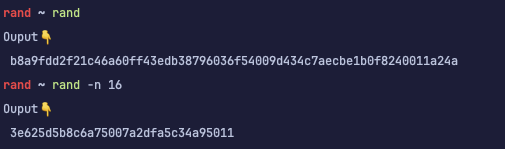

# Rand

A Command-Line tool for generating a cryptographically secure random bytes.



---

### Install

Install it from the sources:
```bash
git clone https://github.com/mukailasam/rand
cd rand
go install
```

Install it from the repository:
```bash
go install github.com/mukailasam/rand
```

### Usage

Please note that the script can only generates between 16 and 100000 bytes.
The default value is 32 bytes and the output will be in hexadecimal format.

Write to the console:
```bash
rand -n <numberOfBytes>
```

Write to a file:
```bash
rand -n <numberOfBytes> -o <file>
```

